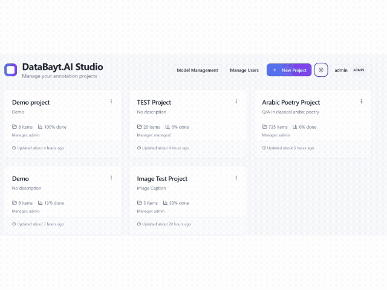

# DataBayt.AI Studio

[](https://www.npmjs.com/package/databayt-ai-studio)
[](https://www.npmjs.com/package/databayt-ai-studio)
[](LICENSE)
[](https://nodejs.org)

DataBayt.AI Studio is a self-hosted, team-based data annotation platform with AI-assisted labeling, project governance, model management, and a security-hardened multi-user backend.

## Demo



## Features

### Annotation and Data Workflow

- Multi-format upload: JSON, CSV, TXT
- Text and image annotation tasks
- AI-assisted labeling with human review (accept, edit, reject)
- Manual labeling and partial-progress states
- Confidence scores and model rating support
- Metadata-aware datasets (raw metadata + display metadata columns)
- Dynamic annotation forms from XML config
- In-app XML editor and default XML template
- Custom upload prompt and prompt interpolation using metadata placeholders (`{{columnName}}`)
- Keyboard shortcuts, list/record views, filtered navigation
- Undo/redo support for annotation edits
- Hugging Face dataset import (browse and import public datasets directly)

### AI Providers and Model Ops

- Provider support: OpenAI, Anthropic, OpenRouter, SambaNova, Local (Ollama)
- Provider proxy routes on backend (`/api/openai/*`, `/api/anthropic/*`, `/api/openrouter/*`, `/api/sambanova/*`)
- Central model management page for:
  - Provider connections (API key, base URL, active state)
  - Model profiles (model, prompt, temperature, max tokens, optional pricing)
  - Project model policies (allowed/default profiles per project)
- Profile test action before production use
- Batch processing scopes: current item, filtered items, all items
- Token estimate and cost-aware workflow support in workspace

### Team Collaboration and Governance

- Role-based access control: `admin`, `manager`, `annotator`
- Project-level manager and annotator assignment
- Invite-link onboarding with token validation, expiry, max-use limits, activate/deactivate
- Self-service signup via invite link (`/signup?token=...`)
- User management (create/edit/delete users, role updates, admin password reset)
- In-app notification system (bell icon) with deep-link navigation to relevant items
- Threaded comments on individual data points
- Audit log entries for key project actions (upload, AI processing, export, assignment)
- Annotation guidelines per project
- Version history snapshots with restore
- Inter-annotator agreement (IAA) configuration:
  - Enable/disable IAA
  - Percent of items to duplicate
  - Annotators per IAA item

### Onboarding

- Guided interactive tutorial on first login (dashboard + workspace), powered by driver.js
- Tutorial deferred until forced password change is completed
- Demo practice project automatically created for every new user (sentiment analysis task with 10 pre-labeled samples)
- "Example" badge on demo projects so they are easy to identify

### Export and Publishing

- Export annotated datasets to:
  - JSON
  - CSV
  - JSONL
- Export includes content, labels, AI suggestions, ratings, metadata, custom XML fields, annotator fields, status, confidence
- Hugging Face dataset publishing support (private dataset repo flow)

### Backend and Persistence

- Express 5 backend API
- SQLite persistence (`better-sqlite3`) with WAL mode and indexed tables
- Paginated project data API for large datasets
- Granular single-data-point patch updates

### Security

- JWT-based authentication (8h expiry); tokens stored in `sessionStorage`
- bcrypt password hashing (rounds = 12) with transparent migration of legacy plaintext passwords on first login
- Default admin account seeded with `must_change_password = true`
- `helmet` security headers on all responses
- Login endpoint rate-limited (10 requests / 15 min per IP)
- All AI proxy routes and write endpoints require a valid JWT
- API keys masked in provider connection responses
- Hugging Face tokens stored in `sessionStorage` (not `localStorage`)
- CORS open by default for self-hosted flexibility; restrict via `ALLOWED_ORIGINS` env var when needed

## Tech Stack

- React 18 + TypeScript + Vite
- Tailwind CSS + shadcn/ui
- Express 5
- SQLite (`better-sqlite3`)
- `bcryptjs` — password hashing
- `jsonwebtoken` — JWT auth
- `helmet` — HTTP security headers
- `express-rate-limit` — login rate limiting
- `js-tiktoken` — token estimation
- `@huggingface/hub` — dataset publishing
- `driver.js` — guided tutorial overlay

## Quick Start

### Prerequisites

- Node.js 18+

### Installation

```bash
npm install
```

### Environment

Copy `.env.example` to `.env` and set at minimum:

```bash
cp .env.example .env
```

```env
JWT_SECRET=your-random-secret-at-least-32-chars
PORT=3000
```

The server will warn on startup if `JWT_SECRET` is not set and fall back to an insecure default — **always set this in production**.

### Run frontend + backend

```bash
npm run dev:all
```

Default frontend URL: `http://localhost:8080` (or `PORT` env value).

### Default credentials

| Username | Password | Notes                               |
| -------- | -------- | ----------------------------------- |
| `admin`  | `admin`  | Must change password on first login |

## Project Structure

```text
src/
  components/
    DataLabelingWorkspace.tsx   # Main annotation workspace
    UserMenu.tsx                # User dropdown + forced password change
    NotificationBell.tsx        # In-app notification bell
    Tutorial/
      useTutorial.ts            # driver.js hook + localStorage state
      tourSteps.ts              # Dashboard and workspace step definitions
      tutorial.css              # Tour popover styling
  pages/
    Dashboard.tsx               # Project list, user management, login
    ModelManagement.tsx         # Provider connections, model profiles, policies
    Signup.tsx                  # Invite-link self-registration
  services/
    apiClient.ts                # Typed API client (Bearer token auth)
    aiProviders.ts              # AI provider integrations
    exportService.ts            # JSON / CSV / JSONL export
    modelManagementService.ts   # Model profile helpers
    projectService.ts           # Project CRUD service layer
    huggingFaceService.ts       # HF dataset import / publish
    xmlConfigService.ts         # XML annotation config parser
  types/
    data.ts                     # Shared TypeScript interfaces
  contexts/
    AuthContext.tsx             # JWT auth context (login, logout, user CRUD)
server/
  index.js                      # Express app, middleware, route registration
  middleware/
    auth.js                     # JWT verify (attachUser), requireAuth, requireRole, generateToken
  routes/
    projects.js                 # Project and data point CRUD, snapshots, audit log
    users.js                    # Auth (login, signup, /me), user CRUD, invite tokens
    models.js                   # Provider connections, model profiles, policies
  services/
    database.js                 # SQLite init, schema, migrations, default seed
    notificationService.js      # Notification creation helpers
```

## API Key and Provider Setup

Configure providers in **Model Management**:

1. Create a provider connection (provider, API key, optional base URL)
2. Create one or more model profiles on that connection
3. Assign allowed/default profiles per project via project model policy

Profiles can then be selected in the workspace to process data.

## Authentication and Access Control

| Role        | Permissions                                                           |
| ----------- | --------------------------------------------------------------------- |
| `admin`     | Full access — user management, all projects, model management         |
| `manager`   | Manage assigned projects, create/edit annotators, view model management  |
| `annotator` | Access only assigned projects; annotate data                          |

Admins can create users directly or generate invite links with a role preset, expiry, and max-use count.

## Data Notes

- **CSV**: All columns preserved in metadata; select which to display in the workspace sidebar.
- **JSON**: Supports flexible payloads including text and image-style records.
- **TXT**: Each line treated as a separate text item.
- **Hugging Face**: Browse and import public datasets directly from the workspace.

## Deployment Notes

- Deploy both frontend build and backend on the same origin, or configure `CORS` and `ALLOWED_ORIGINS` accordingly.
- Set `JWT_SECRET` to a strong random value (e.g. `openssl rand -hex 32`).
- The SQLite database file is created at `server/data/databayt.sqlite` by default; set `DATA_DIR` env var to change the location.
- All provider API keys are stored in the database and never exposed in full to the client.

## Troubleshooting

### Provider/model list not loading

- Confirm backend is running (`npm run dev:all`)
- Verify API key in Model Management → Connections
- Check browser network tab for proxy route errors

### Upload issues

- Confirm file is valid JSON/CSV/TXT
- For CSV, ensure headers are present in the first row

### AI processing errors

- Verify active model profile + active provider connection
- Check API key credits/limits
- For local Ollama, ensure endpoint is reachable (`http://localhost:11434`)

### Access denied in project or model pages

- Confirm user role and project assignment in User Management

### Login returns 401 after server restart

- `sessionStorage` tokens are tab-scoped and do not persist across browser sessions — simply log in again

## License

This project is licensed under the **GNU Affero General Public License v3.0 (AGPL-3.0)**.

You are free to use, modify, and distribute this software under the terms of the AGPL-3.0. Any modified version deployed as a network service must also be made available under the same license.

See the [LICENSE](LICENSE) file for the full license text.
